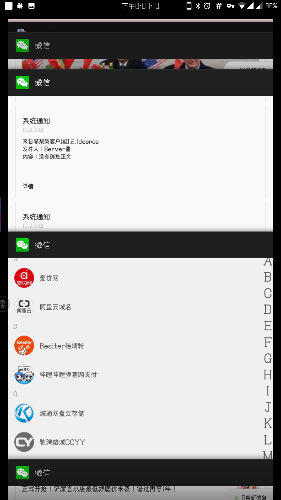
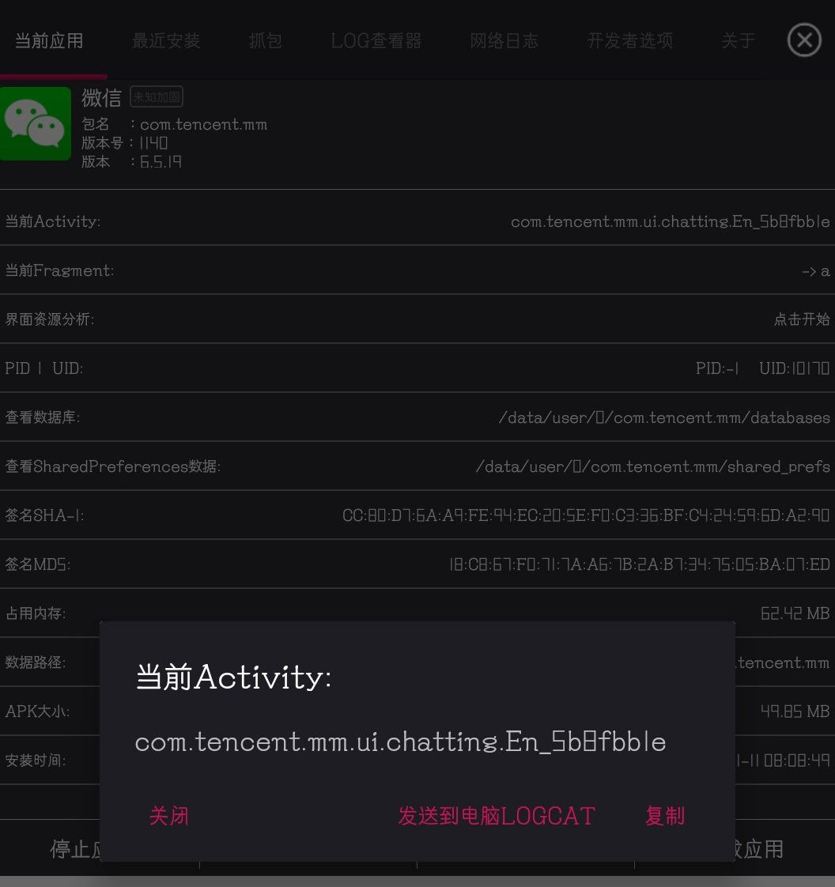
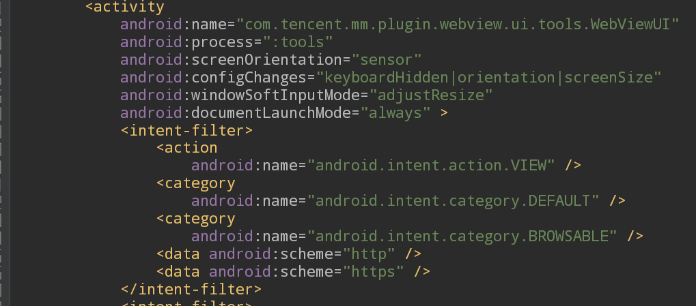

# [⇦][] 开启微信超级窗口，聊天看文两不误  
其实微信曾经加过一次超级窗口，那差不多是在5.4版本的时候了，开启方式是//multiwebview，不过只支持网页，而今天琴梨梨就要把这个已经被移除的功能找回来，顺带让聊天窗口获得这个功能  
先丢张效果图  
  
那么我们就开始吧  
警告:这个功能只能在5.0＋原生/类原生上生效，部分高定ROM是不支持的，因为最近任务被魔改了，已知miui支持但是体验糟糕，另外建议不要在第三大系统(滑稽)yunos上尝试，否则可能导致微信出现不明错误  
工具还是mt管理器，这次不建议在电脑上操作，因为琴梨梨发现apkdb对于manifest的反编译比较糟糕，如果必须使用电脑，请选择shakatool作为反编译和编译版本  
STEP1:先把微信安装包准备好，原则上建议使用未签名版本，已签名版本可能不能正常的工作  
琴梨梨这次使用6.5.19patch版(使用琴梨梨自己的wechat patch移除了tinker)  
STEP2:把下面这行代码复制到剪贴板，这是我们操作的关键  
>             android:documentLaunchMode="always"   
这行代码的直接翻译过来的意思就是文档模式。这是安卓5.0专门为office类APP推出的功能，用于同时打开多个文档以提高生产力，今天我们要用这个办法给微信加点生产力  
STEP3:记录我们需要操作的activity  
推荐使用开发者助手方便的获取activity  
  
我们需要操作以下activity  
com.tencent.mm.ui.chatting.En_5b8fbb1e 聊天界面  
com.tencent.mm.plugin.webview.ui.tools.WebViewUI 网页浏览  
com.tencent.mm.plugin.sns.ui.En_424b8e16 朋友圈  
尤其值得注意的是微信从最近消息打开聊天是直接在launchui里打开的，不会进入聊天界面activity，只有通过联系人打开才能进入聊天界面activity  
STEP4:给这些activity加入声明代码  
直接换行插入就行了，记得对齐  
  
  
  
STEP5:保存并安装  
后续:是不是觉得开一堆“微信”很难辨别？那么我们再来给窗口加个命名吧  
打开manifest找到聊天activity，把下面这行代码加进去  
>  android:label="窗口命名"  
这行代码的意思是定义标签名为你想要的名字  
改好后就像下面这样  
  
  
保存安装看看效果吧  
是不是很容易辨别窗体内容了？  

[⇦]: ../../list.md
