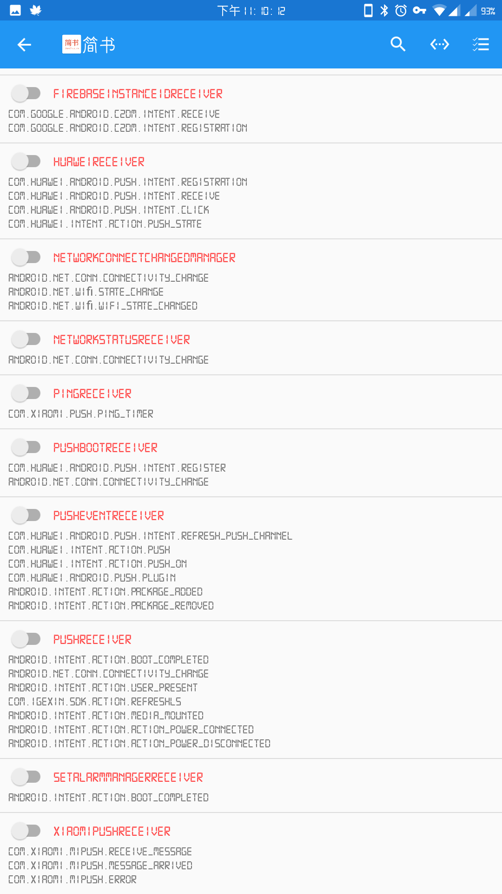
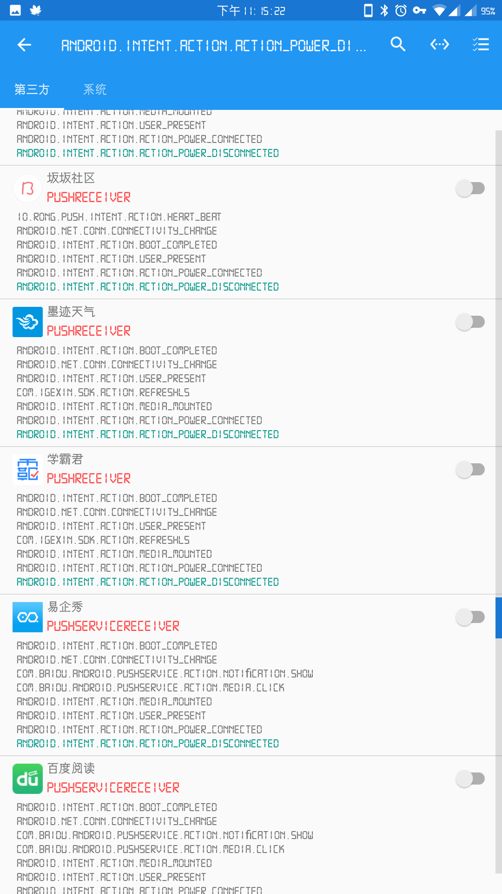
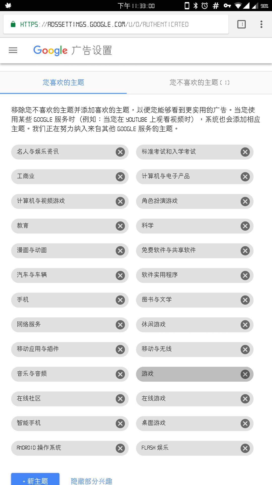
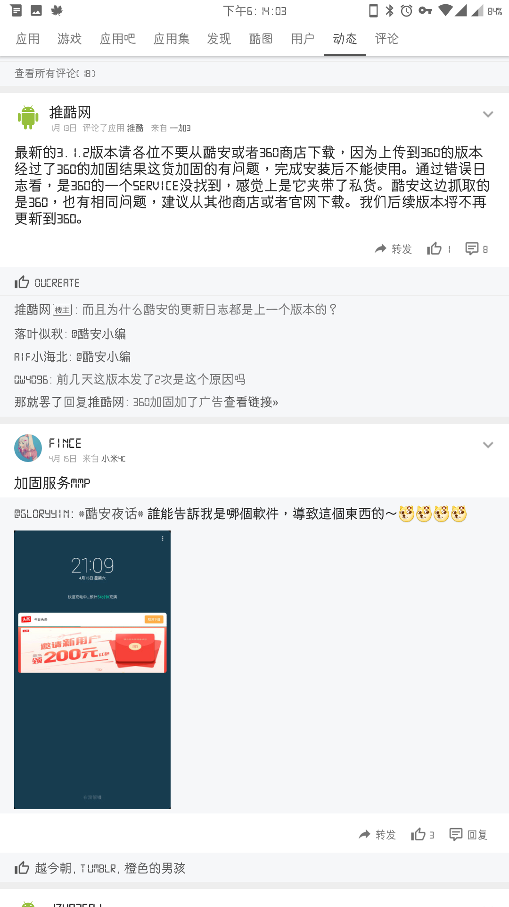
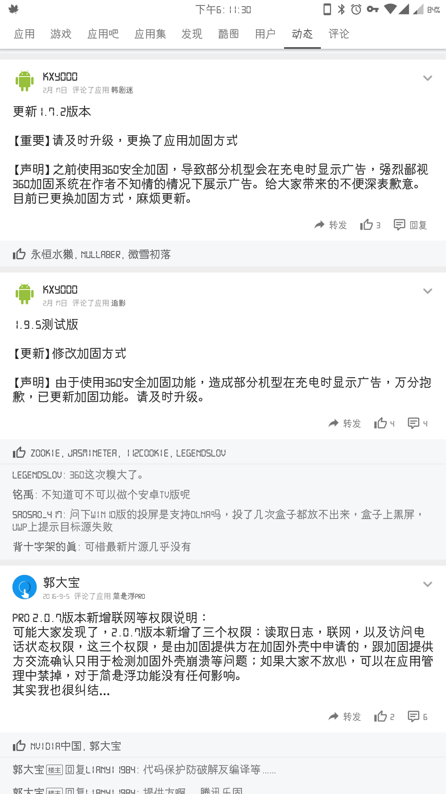
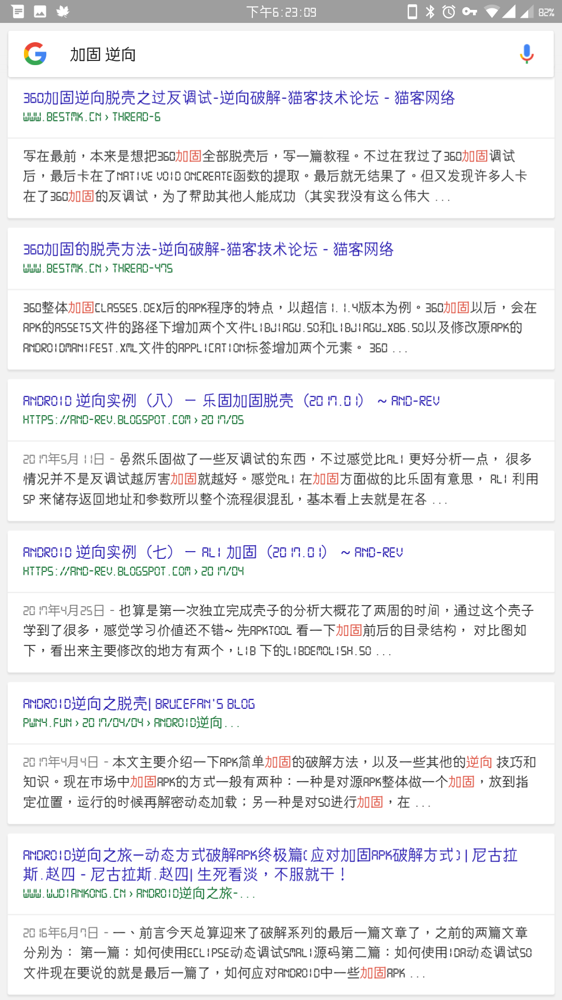
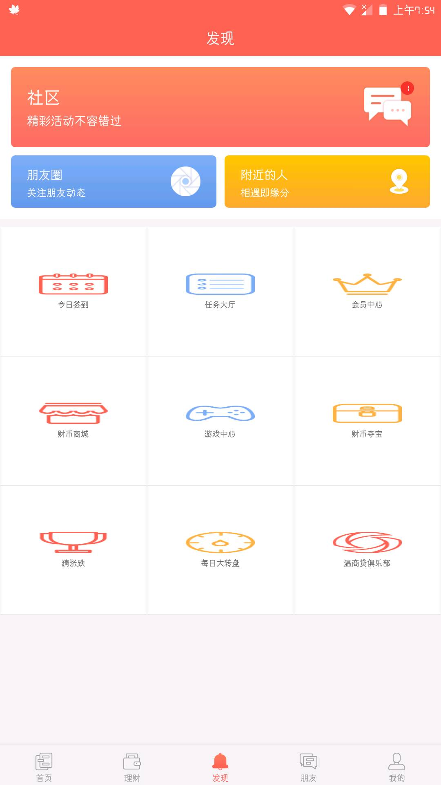
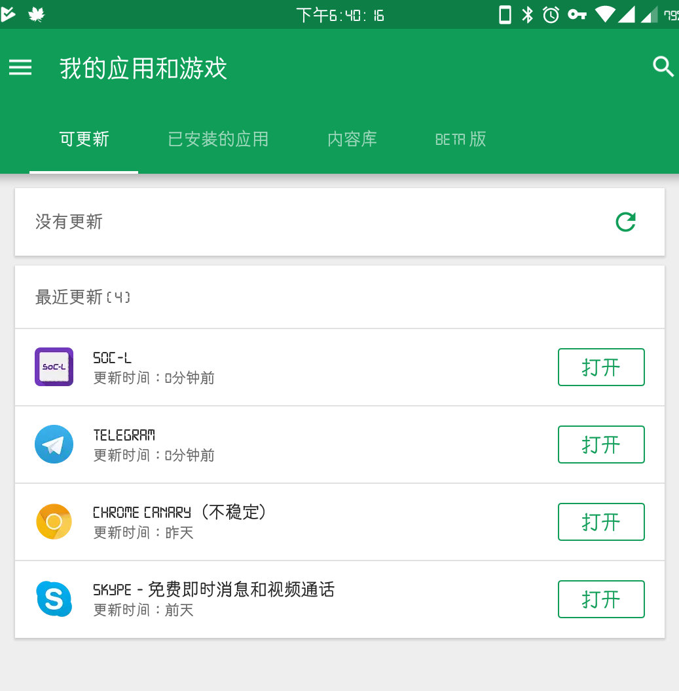
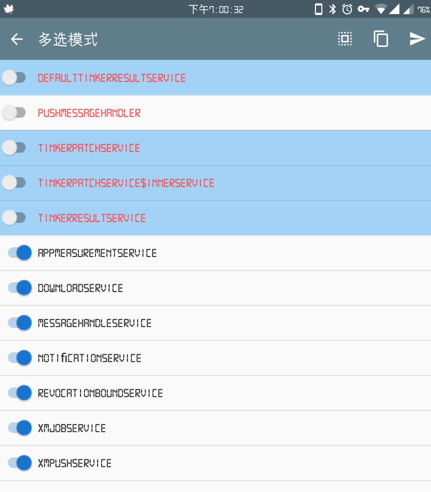

# [⇦][] 是谁让安卓变卡了  
看到这标题肯定有不少人会说是用户，曾经琴梨梨也是这么以为的，但是在几年之后的今天，琴梨梨要站出来说句大实话，安卓卡顿，全都是流氓开发者的锅，今天琴梨梨站出来，就是要喷那些毒瘤app的。  
诺基亚的制造商HMD为中国特别提供了6g运存版本，HMD说中国的安卓环境实在太糟糕了，那里的应用实在太狂野了，只有6g运存可以很好的对付。而google play里的app，只需要4g运存。  
而这一切的根源，就是毒瘤app背后的流氓开发者惹出来的，今天琴梨梨就要从多个角度，抨击部分毒瘤app常见的流氓行为。  
### 1，过度使用接收器(receiver)  
安卓提供了众多的唤醒接口帮助开发者开发出更人性化的app，比如借助插入电源的接收器，kaloer clock的插电自动启动电子钟屏保得以很好的工作;借助卸载应用的接收器，sd女仆可以自启扫描卸载残留。接收器，本来是用于在适当的时候唤醒app执行特定操作的，是用来改善体验的，但是到了流氓手里，就成了作恶的工具。  
我们来看看对比  
下图是清理软件dir申请的接收器，用于卸载后扫描垃圾，很正常  
  
dir的接收器  
现在我们看看简书使用了哪些流氓接收器  
  
简书使用的部分接收器  
简书的这些接收器有什么用呢？我们一条条看，发现插拔电源，挂载分区，安装卸载，开机，乃至网络变化，简书都要启动，而启动的都是推送服务。  
推送服务本来应该由app自己启动，而不应该被这些毫不相关的接收器唤醒。这种过分的滥用接收器，实在流氓。  
而且不仅仅是简书一个，在插入充电器时，下面的APP都要被唤醒  
  
现在拔掉充电器，一大堆app又唤醒了  
  
所以说频繁拔插充电头伤手机虽然科学无法解释，却可以从自启动解释。琴梨梨曾经刻意使用接触不良的数据线，不对app自启做管控，频繁断开充电，然后手机瞬间卡的不能自理，就是这些流氓自启害的。  
### 2，到处拉屎(产生垃圾文件)  
人要吃喝拉撒，app自然也一样，但是正常人都会去厕所排泄，app却不一样。  
谷歌为app准备了多个厕所，包括cache分区，data目录下的cache文件夹，sd卡数据目录内的cache文件夹等等。一部分app很守规矩的把屎拉进了厕所，还有的呢？有的拉屎在袋子里然后写上名字随手一丢(在sd卡内随意以应用身份建立文件夹存放)，有的名字都不写(普通的创建文件夹)，更有甚者，光天化日之下就拉在马路上(直接存放在sd卡根目录)  
就拿QQ举例除了拉在谷歌提供的厕所里，先自己造了tencent目录这个新厕所，在里面拉了一点，又跑出来建了tbslog临时厕所，建立appbuffer_qq临时厕所等一大批临时厕所。  
  
QQ的部分厕所  
而不仅仅是QQ，支付宝等app也在这么做。你可能觉得大街上安几个临时厕所没关系，可是如果满大街到处都是呢？到处都是临时厕所当然就脏乱差了。  
更重要的是，厕所如果有保洁人员打扫还没事，可是没有保洁人员打扫就会臭气熏天，而这些流氓建立的厕所无人打扫，屎越积越多，用户不去主动清理就会爆满。  
当大街上全是屎都满的漫出来的厕所时，这条大街一定没人愿意走了。  
### 3，广告啊你能不能聪明点  
作为一个业余开发者，我是不反对广告的，我知道程序猿也要吃饭糊口，也要赚钱供女朋友，广告是很重要的，可是流氓毕竟没文化，广告一个比一个笨。  
明明手机上装了一批日厂手游，却给我推送一刀999级。明明我最近在查固态硬盘，推荐的关键字却是无动力风机。这样的广告，有意义吗？  
说起广告不得不提提谷歌前辈  
  
谷歌的广告设置  
使用谷歌不到一年，谷歌已经基本摸清楚了我的喜好，准确率在80%左右，而且允许我个人修改喜好，比如之前莫名其妙混进去的育儿已经被我设置为不感兴趣了。  
广告，本来就应该是人性化的，有针对性的。有针对性的广告才能有效果。这点国内百度跟进比较快，在使用百度搜索几次固态之后现在百度的广告已经都是固态了。  
但是除了谷歌和百度的广告以外，琴梨梨看到的广告还是以一刀999级和化妆品为主，而这些琴梨梨都不需要，这些广告只能在眼前一闪而过，琴梨梨并不会点开。  
稍微懂点网络广告常识的人都知道广告分展示收入和点击收入，其中展示收入是很低的，点击收入却很高，一次点击可以抵成百上千次展示。如果广告稍微能迎合用户需求，哪怕一个月被点击一次，也比展示100次来的赚。  
琴梨梨知道肯定有开发者说不想收集用户隐私，琴梨梨只想说，这个充满大数据的时代你的app收集了多少用户隐私你自己心里没点B数吗？(大厂:B数？我没有！我很膨胀！)这是个没有隐私的时代，既然已经收集了数据，那就把它用在正确的地方吧。  
### 4，加固其实不安全  
大概是去年开始，流行起了app加固，所谓加固，就是把包含编译后代码的dex文件用技术手段隐藏起来，在用户启动app时再解密dex并执行。  
加固往往宣传时会说自己“安全”，可以保护开发者，但是实际上，加固不仅不安全，还会变得更危险。  
众所周知，安卓是基于linux打造的系统，而linux是开源的系统，根据协议，安卓也是开源的。因此，安卓上的app，正常情况下是可以直接反编译出源代码的。安卓源代码编译后，以dex文件存储在安装包内，而反编译，则是对编译过程的逆向，把dex转为源代码。  
根据gpl等开源相关协议，使用开源项目的项目也必须开源。大多数app为了快捷方便，都是用的开源项目完成某些功能。比如zxing这个二维码扫描的支持库，很多app都使用了，按照道理这些app也应该开源其相关源码，但是很明显大部分app都没开源。  
如果说不开源还可以靠反编译实现变相开源，加固就是彻底的闭源了。加固后的app，不能被直接反编译，加上本身加固就是个闭源的东西，整个app就彻底闭源了。  
且不说违背开源相关协议，毕竟妮x萌萌当初还抄代码呢，就谈谈加固的安全性真相。  
目前所有的加固平台，加固过程都是在云端完成的，你绝对看不见你的安装包在云端被怎么样了，就好比你的老婆出门后你怎么知道她是去和别人开房了还是去大肆挥霍买了一堆奢侈品呢？  
下图是某加固后app在后台时的服务列表，可以看到多了一个stub服务在后台常驻运行，这个是360加固的典型特点，有一个后台残留服务。  
  
某加固后app的后台服务  
那么这个服务是干什么的呢？我们以加固为关键词，去酷安搜索动态。  
  
  
可以看到加固后的应用的后台服务，经常会用来提供广告，很多app之前的充电广告就是加固惹的祸。应用在加固时被动了手脚，加入了一些奇怪的东西。  
你可能觉得广告没什么事情，可是你想想，app在加固过程中可以插入广告组件，那么如果插入的是窃取信息的组件呢，如果是破坏系统的组件呢？今天插的是广告，明天可能就是其他性质更恶劣的。  
而且加固过程要求上传原始安装包，你的原始安装包就暴露在加固平台面前，这就好像全身棵体一样，又有谁能保证一定不看你呢？  
但是很多开发者仍然使用加固，只因为加固号称可以保护源代码避免反编译。可是加固真的能保护源代码吗？我们再以加固＋逆向在谷歌上搜索  
  
看似安全的加固，实际上也是漏洞百出，稍微有点折腾基础的人，只要一小时左右也可以对着教程轻松脱壳，而对于专业的破解团队来说，这点加固根本不是什么事情，真的想要反编译你的app的话这点加固根本没什么用处，也就稍微拖延点时间罢了。  
更糟糕的事情是，加固会引发很多bug，以360加固最常见的横屏bug为例，横屏启动某加固后的app，看到界面会各种变形。  
  
其实原因很好解释。安卓app会在安装包的manifest文件中声明每个activity允许的屏幕方向，但是加固平台往往为了兼容性在解密dex文件的过程中不设置屏幕方向，于是app就以一个错误的屏幕比例加载界面，又因为进入到了强制竖屏的activity，于是就导致了界面比例严重错乱。这个bug的触发很简单，横屏桌面下启动一个强制竖屏的加固后app即可触发。  
加固还存在大量兼容性bug，在新系统和新手机上容易发生各种崩溃，而崩溃状态下所有所谓的防调试都是失效的，这些崩溃，间接方便了破解者的脱壳，实在是滑天下之大稽。  
### 5，反人类的应用内更新和热更新  
你是否在进入某app时看到一个“有新版本”的提示框，大多数app中，这个提示框点了确定就会下载新版本安装包，只有少部分会跳转应用市场更新。这种，就是反人类的应用内更新。  
这种乱相，全都是谷歌不入华引发的。根据谷歌的要求，上架play的应用禁止应用内更新，也禁止热更新，因此play上的应用非常的克制。但是放到没有play商店的国内，应用内更新就成了必须。  
安卓系统可以没有应用商店，因此在没有系统级的play商店的情况下，为了让所有机器都能更新，只能应用内更新了。但是应用内更新的害处是无穷的。  
首先就是烦，更新居然还要我手动点，真鸡儿累人。其次就是不清理更新缓存，更新文件还遍地拉屎，吃我存储耗我性能。而且大多数应用在应用内更新前不检测机型，直接推送兼容包，无法发挥设备性能。  
来看看谷歌play的更新是怎样一种体验  
  
在琴梨梨码字的过程中，谷歌已经全自动帮琴梨梨更新好了两个app，琴梨梨全程没看到任何弹出窗口，就自动在后台完成了更新，下载更新一气呵成。  
说到这个不得不提提iOS，苹果的app store和谷歌play一样，统一自动的无感知更新，为什么那么多用户觉得iOS简单好用，这也是原因之一。  
再说说热更新，热更新是在不安装的情况下直接完成更新，在pc端这很常见，毕竟有时候只是一个小文件修补不用全部安装，但是在安卓，虽然安卓作为java虚拟机可以应用内再运行一个虚拟机，但是很明显虽然更新了部分代码，为了正常运行就必须把不更新的一起编译进去。编译是消耗大量资源的，连电脑都要好久，更别提手机了，热更新最直接表现就是卡顿。  
而且你以为编译完就不卡了吗？奶义乌。安卓5.0开始引入了odex，预先分离代码来加速运行。而热更新后并不会进行odex，因此每次启动就都变成了冷启动，启动时间翻倍，还伴随着卡顿。我们来看看热更新有多少消耗资源的服务。  
  
热更新的兼容性也很糟糕，曾经大量xposed用户反馈微信崩溃，经过调查，发现就是微信的tinker热更新惹的祸，插件无法正常hook，于是微信就打不开了。  
热更新诞生的目的其实是节约用户流量，有时候只有一行代码更新，不需要完整下载安装包。但是实际上应用商店也可以省流量更新。谷歌play经常会出现只有30k左右的更新，这就是增量更新，把那一行代码下载下来，和本地安装包拼接成新的安装包并安装。因此热更新实际上还是因为国内play不能用导致的。  
热更新还会大量消耗用户的存储空间，因为更新时不会删除原来的安装包，原来的安装包必须保留，所以就需要两倍于原来的存储占用，这对于16g存储用户来说是绝对致命的。  
###   
其实除了上面说的这五点外，还有诸如过度的异步加载等问题。为了控制文章长度就不再单独提了。在文章的最后，琴梨梨希望开发者能遵守以下几点:  

1. 合理使用接收器，拒绝滥用  
2. 尽可能集中存放一个app的文件，并且尽可能存储在data目录内  
3. 减少用户不感兴趣的广告，提升用户感兴趣的广告的展示比例  
4. 不使用加固，如果希望增加反编译难度，可以使用混淆减少可读性  
5. 尽可能不使用应用内更新，不使用热更新  

作为业余开发者，琴梨梨也知道开发者的不容易，因此琴梨梨并不希望开发者削减自己的收入来提高用户体验，琴梨梨更希望创造开发者和用户共赢的局面，用户体验好，开发者收入才能高。  
最后，安卓的良好生态需要用户和开发者共建，希望将来某一天，中国生态环境下的安卓也可以摆脱“卡卓”的称号。

[⇦]: ../../list.md