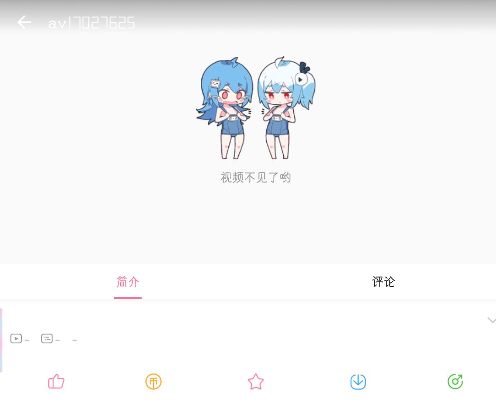

# [⇦][] APP魔改行动3-看懂manifest  
从这一篇开始，可以说是接触到“改”的部分了  
空讲无用，这次以b站5.22版客户端的manifest为例分析  
  
### 1，manifest头  
> <?xml version="1.0" encoding="utf-8"?>  
> <manifest xmlns:android="http://schemas.android.com/apk/res/android"  
>     android:versionCode="5220000"  
>     android:versionName="5.22.0"  
>     package="tv.danmaku.bili">  
manifest实质是一个编译后的xml文件，我们反编译后发现头部是标准的xml头  
android:versionCode就是版本号，类型为integer整型，越大版本越新，检测更新就看这个版本号  
android: versionName是版本名，不一定越大越新，如果开发者版本号改大了版本名改小了，可能会出现“开倒车”升级显示，这个项类型为strings字符，可以随便填写任意语言和特殊字符，包括中文，但是不能和xml语法冲突  
package制定了包名，包名必须至少有一个小数点，由字母和数字和下划线构成  
### 2，一些应该有的声明  
>     <uses-sdk  
>         android:minSdkVersion="15"  
>         android:targetSdkVersion="25" />  
这一段说明要求最低sdk15，适配最佳sdk25  
如果设备sdk低于最低sdk，那么无法安装，会解析错误  
如果设备sdk在最低和最佳之间，那么会运行在部分功能下，部分功能会不可用  
如果设备sdk等于最佳sdk，会运行在最高效率下  
如果设备sdk高于最佳sdk，会运行在兼容模式下，效率打折扣  
>     <uses-permission android:name="android.permission.ACCESS_NETWORK_STATE" />  
声明使用的权限，如果没声明则不可使用该权限  
>     <uses-feature  
>         android:name="android.hardware.camera" 
>         android:required="false" />  
声明需要的设备特性，比如相机，如果required后面为true即强制需要  
>     <supports-screens  
>         android:anyDensity="true"  
>         android:smallScreens="true"  
>         android:normalScreens="true"  
>         android:largeScreens="true"  
>         android:resizeable="true"  
>         android:xlargeScreens="true" />  
声明支持的屏幕尺寸  
### 3，应用本体声明  
#### 3.1，应用主声明  
>     <application  
>         android:theme="@style/AppTheme"  
>         android:label="@string/app_name"  
>         android:icon="@mipmap/ic_launcher"  
>         android:name="tv.danmaku.bili.MainApplication"  
>         android:allowBackup="true"  
>         android:hardwareAccelerated="true"  
>         android:largeHeap="true"  
>         android:supportsRtl="false"  
>         android:fullBackupContent="@xml/backup_content"  
>         android:networkSecurityConfig="@xml/network_security_config"> 
标注了应用的一些整体设置，包括图标和名称等，还有硬件加速等特性  
theme:应用主体风格  
label:应用名称  
icon:应用图标  
name:Application在dex里的位置，不一定有  
allowBackup:允许备份，如果设置为false可以避免被gapps备份  
hardwareAccelerate:硬件加速，如果不设置默认开启  
largeHeap:大头部内存，安卓在启动APP时会先分配一部分内存，具体大小存储在build.prop里  
除了这些常见的值，也可以配置一些少见的值或该APP特有的值  
#### 3.2，活动的声明  
>         <activity  
>             android:theme="@style/AppTheme.Splash"  
>             anroid:name="tv.danmaku.bili.ui.splash.SplashActivity"  
>             android:screenOrientation="portrait">  
>             <intent-filter>  
>                 <action  
>                     android:name="android.intent.action.MAIN" />  
>                 <category  
>                     android:name="android.intent.category.LAUNCHER" />  
>             </intent-filter>  
>         </activity>  
活动的声明应该在主声明下面  
theme:主题，如果不设置则使用主声明配置的主体  
name:活动在dex里的位置  
screenOrientation:屏幕方向  
我们可能还能看到configChanges，这个意味着在声明的情况下不重建活动  
intent-filter子项声明了可以接收传递的intent，比如android.intent.category.LAUNCHER意味着可以从启动器启动。声明intent除了系统特性Intent外还可以是支持打开的链接或者文件格式。  
比如我们可以再来看下面这一段  
>             <intent-filter>  
>                 <action  
>                     android:name="android.intent.action.VIEW" />  
>                 <category  
>                     android:name="android.intent.category.DEFAULT" />  
>                 <category  
>                     android:name="android.intent.category.BROWSABLE" />  
>                 <data  
>                     android:scheme="bilibili"  
>                     android:host="av"  
>                     android:pathPrefix="/17027625" />  
>             </intent-filter>  
>             <intent-filter>  
>                 <action  
>                     android:name="android.intent.action.VIEW" />  
>                 <category  
>                     android:name="android.intent.category.DEFAULT" />  
>                 <category  
>                     android:name="android.intent.category.BROWSABLE" />  
>                 <data  
>                     android:scheme="bilibili"  
>                     android:host="bnj2018" />  
>             </intent-filter>  
这一段声明了遇到bilibili://av/17027625或者bilibili://bnj2018就进入这个活动  
通过这段信息我们可以得出b站2018拜年祭是av17027625，另外扫描下面这张二维码也可以直接进入这个界面(二维码指向链接是bilibili://bnj2018)  
    
推荐用酷安扫描这个二维码，实测有效  
扫码后的效果如下  
  
#### 3.3，服务的声明  
>         <service  
>             android:label="@string/game_download_service"  
>             android:name="tv.danmaku.bili.services.apkdownload.DownloadService"  
>             android:exported="false"  
>             android:process=":game" />  
label:服务的名字  
name:在dex中的位置  
exported:可被其他APP调用  
process:进程，通过配置不同的进程，可以实现多进程，从而充分发挥多核soc的性能  
#### 3.4，接收器的声明  
>         <receiver  
>             android:name="com.bilibili.lib.push.MiMessageReceiver"  
>             android:exported="true">  
>             <intent-filter>  
>                 <action  
>                     android:name="com.xiaomi.mipush.RECEIVE_MESSAGE" />  
>             </intent-filter>  
>             <intent-filter>  
>                 <action  
>                     android:name="com.xiaomi.mipush.ERROR" />  
>             </intent-filter>  
>         </receiver>  
name和其他一样，是在dex里的位置  
exported一般为了从外部唤醒，都会设置为true  
intent-filter里面是接收的项目，在遇到相应操作时，系统会给dex中的这段代码一次调用  
毒瘤经常配置大量的接收器，并且声明大量intent-filter用于保活  
#### 3.5，提供器的声明  
提供器，顾名思义就是提供内容的  
>         <provider  
>             android:name="com.bilibili.column.provider.ColumnMainProcessProvider"  
>             android:exported="false"  
>             android:multiprocess="false" />  
name还是老样子，exported如果设置为true，就可以被外部APP调用  
multiprocess是多进程，开启的话可以和主进程分离执行，提高多核soc的效率，但是也会增加和主进程交互的难度  
#### 3.6，附加信息的声明  
>         <meta-data  
>             android:name="TencentMapSDK"  
>             android:value="3RVBZ-XNCR6-C7GSL-ET55P-SVUAQ-V3FKJ" />  
附加信息并不是必须的声明，但是通过配置附加信息，可以配置好sdk的key等等，也可以添加附加信息来标识渠道等  
name里面可以配置任意的英文/数字  
value里面只要不和xml语法冲突先写啥就写啥  
比如做了个APP，不希望被二传，在发到各处时可以配置不同的附加信息，比如发到群里的，可以这么配置  
>         <meta-data  
>             android:name="channel"  
>             android:value="qun" />  
发到酷安的，就这么配置  
>         <meta-data  
>             android:name="channel"  
>             android:value="coolgay" />  
这样的情况下，如果发现了二传，就可以很容易定位泄包的人来自哪里  
在看懂manifest之后，就可以做一些初步的修改了，下一篇教程，琴梨梨就讲讲可以怎么改manifest（咕）  

[⇦]: ../../list.md